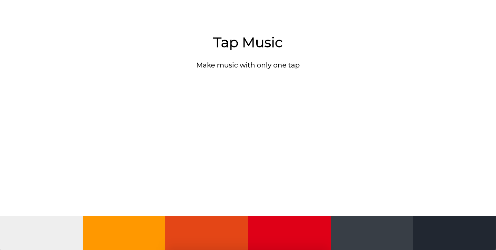

<h1 align="center">Welcome to Music Tap 🎹 🎵</h1>
<p>
  <a href="https://twitter.com/maisamaximo_" target="_blank">
    
  </a>
</p>

> Simple Music Tap project to apply HTML, CSS and JavaScrypt knowledge.

<h5><strong> Followed the AMAZING tutorial:</strong> <a href="https://www.youtube.com/watch?v=2VJlzeEVL8A">Dev Ed</a></h5>



## Instruction
Click on each colored button at the bottom and enjoy a good sound on each high note. Create your own sound!

## Run

```sh
index.html
```

## Author

🙆 **Maisa Maximo**

* Twitter: [@maisamaximo_](https://twitter.com/maisamaximo_)
* Github: [@maisamaximo](https://github.com/maisamaximo)
* Linkedin [Maisa Maximo](https://www.linkedin.com/in/maisa-maximo-ferreira/)

## Show your support

Give a ⭐️ if this project helped you!

***
``` talk code to me ```